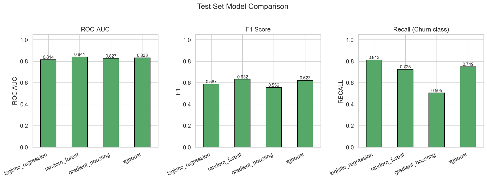

# Telco Customer Churn Prediction

End-to-end machine learning project to **predict telecom customer churn** from subscription, billing, and service data. Includes reproducible preprocessing, multi-model training, cross-validated evaluation, saved artifacts, and analysis notebooks.



---

## Highlights

| Metric (test set, champion) | Value |
|------------------------------|------:|
| **Model** | Random Forest |
| **ROC-AUC** | 0.841 |
| **PR-AUC** | 0.648 |
| **F1 (churn class, tuned threshold)** | 0.643 |
| **Recall (churn)** | 0.807 |
| **5-fold CV ROC-AUC** | 0.844 ± 0.008 |

The pipeline optimizes the decision threshold on the validation split to balance precision and recall for the minority churn class (~26.5% of customers).

---

## Project structure

```
Telco-Customer-Churn-Predictor/
├── configs/
│   └── config.yaml              # Paths and training settings
├── data/
│   ├── raw/data.csv             # Original Kaggle-style telco data
│   └── processed/cleaned.csv    # One-hot encoded features + Churn
├── notebooks/
│   ├── 01-eda.ipynb
│   ├── 02-feature_engineering.ipynb
│   ├── 03-modeling.ipynb
│   └── 04-evaluation.ipynb
├── reports/
│   ├── figures/                 # EDA + model evaluation plots
│   └── metrics/                 # JSON metrics and CV scores
├── models/                      # Serialized estimators + champion bundle
├── scripts/
│   ├── train.py                 # Full training pipeline
│   ├── generate_eda.py          # EDA figures only
│   ├── predict.py               # CLI scoring
│   └── build_notebooks.py       # Regenerate notebook templates
├── src/
│   ├── config.py
│   ├── data/make_dataset.py
│   ├── features/preprocess.py
│   ├── models/train.py, predict.py
│   ├── evaluation/metrics.py
│   └── visualization/plots.py
└── requirements.txt
```

---

## Dataset

- **Source:** [Telco Customer Churn (Kaggle)](https://www.kaggle.com/datasets/blastchar/telco-customer-churn)
- **Rows:** 7,043 customers (after cleaning)
- **Target:** `Churn` (0 = stayed, 1 = churned)
- **Features:** 45 encoded inputs (numeric + one-hot categoricals)

Key business drivers observed in EDA:

- Short **tenure** and **month-to-month** contracts correlate with churn
- **Fiber optic** and **electronic check** payment segments show higher churn rates
- Long-tenure customers on **two-year** contracts rarely churn

---

## Quick start

```bash
# Clone and install
git clone <your-repo-url>
cd Telco-Customer-Churn-Predictor
pip install -r requirements.txt

# Generate EDA figures
python scripts/generate_eda.py

# Train models + evaluation figures + metrics
python scripts/train.py

# Score customers (processed CSV)
python scripts/predict.py data/processed/cleaned.csv
```

### Notebooks

Run in order from the project root (or ensure `notebooks/` sets `ROOT` to parent):

1. **01-eda** — distributions, churn rates, correlations  
2. **02-feature_engineering** — preprocessing and stratified split  
3. **03-modeling** — trains all models and saves `models/`  
4. **04-evaluation** — metrics tables and figure gallery  

---

## Approach

1. **Preprocessing** — Drop `customerID`, coerce numerics, impute missing `TotalCharges`, map churn to 0/1, one-hot encode categoricals (`src/data/make_dataset.py`).
2. **Modeling** — Logistic regression, random forest, gradient boosting, XGBoost with class imbalance handling (`src/models/train.py`).
3. **Evaluation** — ROC/PR curves, confusion matrix, calibration plot, learning curve, 5-fold CV ROC-AUC (`reports/`).
4. **Deployment-ready artifacts** — `models/champion_bundle.joblib` stores the model, feature list, and optimal threshold for inference.

---

## Reports and figures

| Figure | Description |
|--------|-------------|
| `eda_churn_distribution.png` | Class balance |
| `eda_numerical_boxplots.png` | Tenure, charges vs churn |
| `eda_categorical_churn_rates.png` | Churn rate by contract, internet, payment |
| `eda_correlation_heatmap.png` | Top feature correlations |
| `roc_curves.png` / `pr_curves.png` | Model discrimination |
| `model_comparison.png` | ROC-AUC, F1, recall bar chart |
| `confusion_matrix_champion.png` | Tuned classifier confusion matrix |
| `feature_importance.png` | Top drivers (champion model) |
| `learning_curve.png` | Bias/variance check (5-fold CV) |
| `calibration_champion.png` | Probability calibration |

---

## Model comparison (test set)

| Model | ROC-AUC | F1 | Recall (churn) |
|-------|--------:|---:|---------------:|
| Logistic regression | 0.842 | 0.618 | 0.786 |
| **Random forest (champion)** | **0.841** | **0.643** | **0.807** |
| XGBoost | 0.833 | 0.623 | 0.749 |
| Gradient boosting | 0.827 | 0.556 | 0.505 |

Full metrics: `reports/metrics/all_models_test.json`

---

## Future work

- [ ] FastAPI / Streamlit serving layer  
- [ ] MLflow experiment tracking  
- [ ] Scheduled retraining on fresh data  
- [ ] SHAP explanations for account managers  

---

## License

MIT License — see [LICENSE](LICENSE) if present.

## Acknowledgments

- [Kaggle Telco Customer Churn](https://www.kaggle.com/datasets/blastchar/telco-customer-churn)  
- scikit-learn, XGBoost, pandas, matplotlib, seaborn
